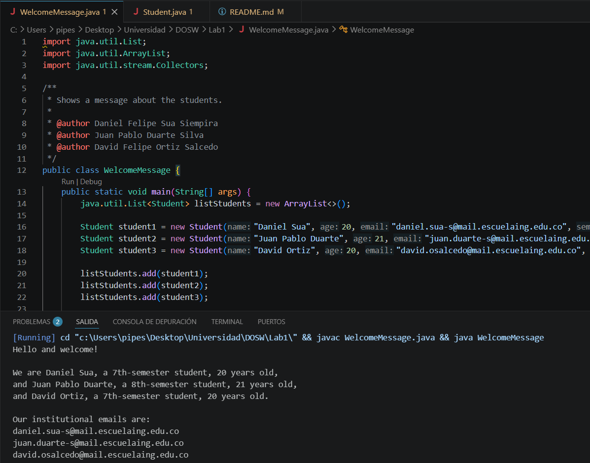

# DOSW_Lab1_Sua_Duarte_Ortiz

## Integrantes:
* Daniel Felipe Sua Siempira

* Juan Pablo Duarte Silva
  
* David Felipe Ortiz Salcedo

## Acuerdos de trabajo en equipo
Cada equipo debe definir acuerdos de trabajo en equipo, es decir, las reglas que utilizarán para trabajar juntos durante el semestre:

* ¿A qué horas se encontrarán?
Nos encontraremos ya sea presencial o asincronamente en alguna de las siguientes franjas o en varias de ellas: lunes por la mañana, martes 1:00 pm - 2:30 pm y jueves 8:30 - 10:00.
* ¿Cuáles serán sus canales de comunicación: Teams, WhatsApp, Slack...?
WhatsApp para comuniación rapida, teams y discord para archivos y videollamadas.
* ¿Con qué frecuencia se van a reunir?
2 sesiones una de ellas presencial otra asincrona según la disponibilidad de cada integrante.
* Si surgiera un conflicto, ¿cómo se podría resolver?
Se resolveria con la comunicación efectiva, exponiendo los desacuerdos de cada uno y entre el grupo se decidirá cual es la mejor solución al problema que surja.

## Reto 1 - Welcome Message

### Evidencia

### Descripción

Para la realización de este reto, se usó una lista para guardar
los objetos estudiante de acuerdo a la cantidad de miembros que hay
en el grupo. Así mismo, se usó un stream para filtrar los datos
de los estudiantes y se utilizó el método map para transformar los
datos con el uso de métodos getter de acuerdo a la información de cada
estudiante. Seguidamente, se utilizó el método joining de la clase
Collectors para unir el texto y se pueda ver correctamente.
Finalmente, se utiliza otro stream para obtener los correos de los
estudiantes.
Los comandos usados para subir este reto en el repositorio fueron git add, 
commit y push en la rama feature/challenge1_OrtizDavid_2026-2. 
No hubo conflictos durante el merge en develop.

## Reto 4 — The Treasure of Duplicate Keys

### Evidencia

### Descripción

Para este reto implementé dos métodos que guardan datos en un HashMap y en un 
Hashtable, ambos ignorando las claves que ya existen (usando putIfAbsent). Luego hice 
un método que junta los dos mapas: si una clave se repite en ambos, se queda con el 
valor del Hashtable, y al final las claves quedan en mayúsculas y ordenadas usando 
un TreeMap con stream y Collectors.toMap.
 
Subí los cambios con git add, commit y push a mi rama feature/challenge_4_SuaDaniel_2026-2, 
y después la fusioné a develop con git merge. No tuve conflictos porque nadie más 
estaba trabajando en los mismos archivos.

## Reto 6 — The Decision Machine

### Evidencia

### Descripción

Implementé una máquina de comandos usando un `Map<String, Runnable>` donde cada comando 
está asociado a una lambda que imprime su respuesta. El método executeCommand usa un 
switch para validar que el comando exista antes de ejecutarlo con .run(). Hice los 8 
comandos. Subí los cambios con git add, 
commit y push a mi rama feature/challenge_6_SuaDaniel_2026-2, y los fusioné a develop 
con git merge. No hubo conflictos.
