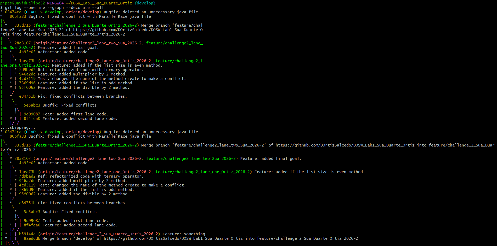
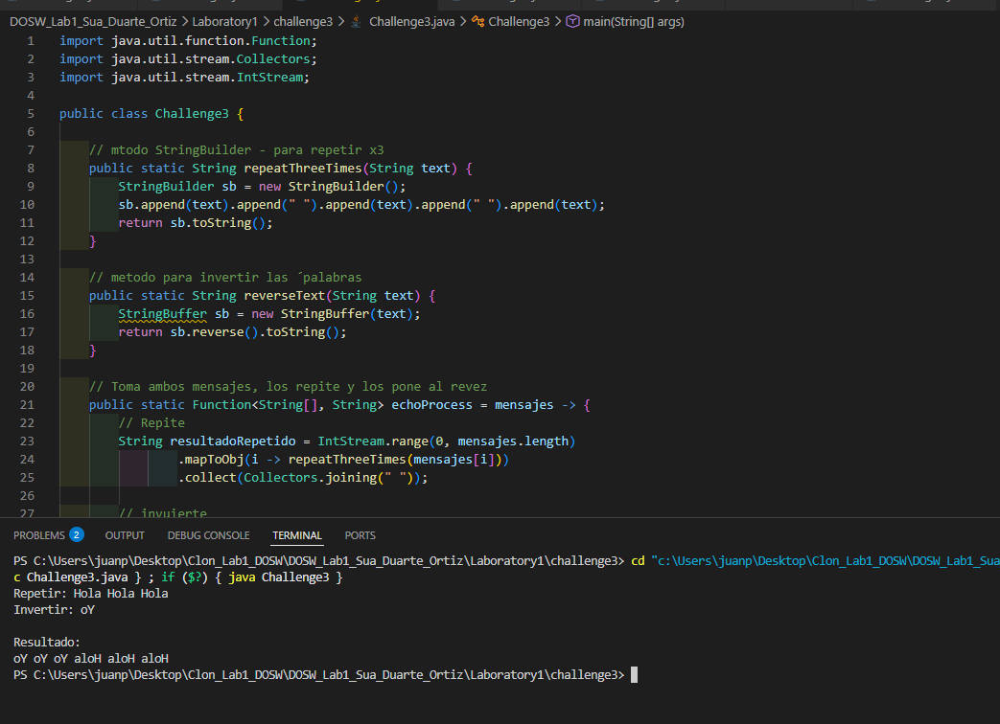
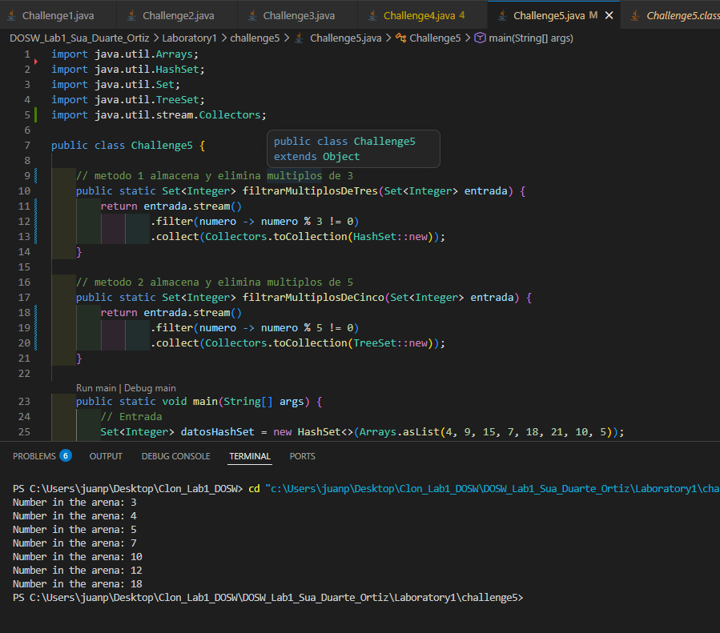
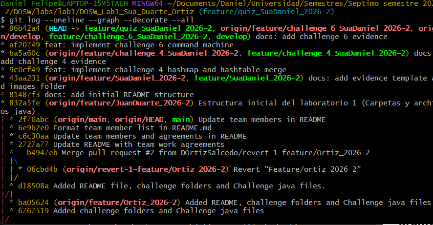

# DOSW_Lab1_Sua_Duarte_Ortiz

## Integrantes:
* Daniel Felipe Sua Siempira

* Juan Pablo Duarte Silva
  
* David Felipe Ortiz Salcedo


## Reto 1 - Welcome Message

### Evidencia


### Descripción

Para la realización de este reto, se usó una lista para guardar
los objetos estudiante de acuerdo a la cantidad de miembros que hay
en el grupo. 

Así mismo, se usó un stream para filtrar los datos
de los estudiantes y se utilizó el método map para transformar los
datos con el uso de métodos getter de acuerdo a la información de cada
estudiante. 

Seguidamente, se utilizó el método joining de la clase
Collectors para unir el texto y se pueda ver correctamente.
Finalmente, se utiliza otro stream para obtener los correos de los
estudiantes.

Los comandos usados para subir este reto en el repositorio fueron `git add`, 
`git commit` y `git push` en la rama `feature/challenge1_OrtizDavid_2026-2`. 
No hubo conflictos durante el merge en develop.

## Reto 2 - Parallel Commit Race

### Evidencia



Primeramente, realizamos las respectivas ramas: `feature/challenge_2_Sua_Duarte_Ortiz_2026-2` y subramas: `feature/challenge2_lane_one_Ortiz_2026-2` y `feature/challenge2_lane_two_Sua_2026-2` con el fin
de llevar la lógica de la carrera de commits y poder solucionar los
conflictos (sin embargo, al intentar realizar dichas ramas tuvimos problemas dado que un compañero no veía las ramas por lo que tuve que
realizarlo individualmente).

Seguidamente, se implementaron las funciones lambda de la primera línea
para poder retornar el número mayor, el número menor y la cantidad total de elementos con los métodos `min()`, `max()` y `count()` de la estructura de datos stream y se realizó la primera colisión, solucionándolo y siguiendo con la segunda línea; de la cual, era una verificación de pares usando el operador ternario y sucedió un conflicto entre archivos, logrando solucionarlo.

Finalmente, se creó una función que contenga el objeto Results, reutilizando todo lo hecho anteriormente.

- Se usaron los comandos `git add`, `git commit`, `git push`, `git switch`, `git pull origin` para ramas, subramas y develop. Los conflictos que aparecieron más que todo fue por eliminación de archivos y/o modificación de código, estos fueron solucionados editando el código que Visual Studio Code permite modificar. 

## Reto 3 — The Mysterious Echo

### Evidencia


### Descripción

Para este problema para la primera parte se creó el método `repeatThreeTimes()` usando StringBuilder y para la segunda parte se creó el método `reverseText()` usando StringBuffer. En la lambda `echoProcess` se usaron Streams para repetir el texto tres veces y luego invertirlo uniendo ambos.

- Se dividió el trabajo en dos ramas: `feature/challenge3_builder_Duarte_2026-2` y `feature/challenge3_buffer_JuanDuarte_2026-2`.
- Use `git add`, `git commit`, `git push`, `git merge` y `git pull origin develop`.

El conflicto paso al fusionar la segunda rama en develop, ya que ambas usaban la misma función lambda `echoProcess` en Challenge3 y lo resolvimos aceptando ambos cambios en VS Code (accept both changes), luego unificamos StringBuilder + Stream + StringBuffer y lo guardamos con `git add`, `git commit` y `git push`.

## Reto 4 — The Treasure of Duplicate Keys

### Evidencia


### Descripción

Para este reto se implementaron dos métodos que guardan datos en un HashMap y en un Hashtable, ambos ignorando las claves que ya existen (usando putIfAbsent). Luego se realizó un método que junta los dos mapas: si una clave se repite en ambos, se queda con el 
valor del Hashtable, y al final las claves quedan en mayúsculas y ordenadas usando un TreeMap con stream y Collectors.toMap.
 
Se subieron los cambios con `git add`, `git commit` y `git push` a la rama `feature/challenge_4_SuaDaniel_2026-2`, 
y después se fusionó a develop con `git merge`. No hubo conflictos porque nadie más estaba trabajando en los mismos archivos.

## Reto 5 — Battle of Sets

### Evidencia


### Descripción

Para este reto se hicieron dos métodos usando `stream().filter()`: En el método 1 se convirtió un HashSet a Stream para dejar solo los números % 3 != 0, y en el método 2 se hizo lo mismo con un Tregit statuseSet para descartar los múltiplos de 5. En el main se juntaron los dos conjuntos filtrados en un TreeSet y se imprimió todo usando `.forEach()` con una función lambda.

Se subieron los cambios con `git add`, `git commit` y `git push` a la rama `feature/challenge5_JuanDuarte_2026-2`, y 
después se fusionó a develop con `git merge`. 

## Reto 6 — The Decision Machine

### Evidencia


### Descripción

Se implmentó una máquina de comandos usando un `Map<String, Runnable>` donde cada comando está asociado a una lambda que imprime su respuesta. El método executeCommand usa un switch para validar que el comando exista antes de ejecutarlo con `.run()`. Se Hicieron los 8 
comandos. Se subieron los cambios con `git add`, `git commit` y `git push` a la rama `feature/challenge_6_SuaDaniel_2026-2`, y se fusionaron a develop con `git merge`. No hubo conflictos.


## Questions
### 1. Acuerdos de trabajo en equipo

* ¿A qué horas se encontrarán?
Nos encontraremos ya sea presencial o asincronamente en alguna de las siguientes franjas o en varias de ellas lunes de por la mañana, martes 1:00 pm - 2:30 pm y jueves 8:30 - 10:00.
* ¿Cuáles serán sus canales de comunicación: Teams, WhatsApp, Slack...?
WhatsApp para comuniación rapida, teams y discord para archivos y videollamadas.
* ¿Con qué frecuencia se van a encontrar?
2 sesiones, una de ellas presencial otra asincronica según disponibilidad.
* Si surgiera un conflicto, ¿cómo se podría resolver?
Se resolvería con la comunicación efectiva, exponiendo los desacuerdos de cada uno y entre el grupo se decidiría cual es la mejor solución a dicho problema.

### 2. ¿Cuál es la diferencia entre git merge y git rebase?
`git merge` une dos ramas creando un nuevo commit que combina los historiales. `git rebase` mueve los commits de una rama para que queden encima de otra, como si hubieran partido desde ahí, es decir, reescribe el historial para que se vea líneal.

### 3. ¿Qué pasa cuando dos ramas modifican la misma línea de un archivo?
Como git no puede decidir automáticamente cual cambio conservar, genera un conficto de merge. Marcando el archivo con símbolos de flecha, mostrando ambas versiones de los programadores que deben editar manualmente para resolver qué es lo que deja.

### 4. ¿Cómo mostrar gráficamente el historial de ramas y fusiones en la terminal?
Usando el comando 
```
git log --online --graph --decorate --all

```

Podemos ver como se dibuja un árbol ASCII mostrando ramas. Commits que se fusionaron.



### 5. ¿Diferencia entre commit y push?

`git commit` guarda el progreso en el historial local(de mi pc) y `git push` envia dichos commits al repositorio GitHub, haciéndolos visibles para todos.

### 6. ¿Qué son git stash y git stash pop, para qué se utilizan?

`git stash` sirve para guardar temporalmente los cambios que se están haciendo sin hacer un commit y `git stash pop` recupera esos cambios y permite seguir trabajando desde donde nos habíamos quedado.

### 7. ¿Cuál es la diferencia entre HashMap y Hashtable?

Los dos sirven para guardar información usando una clave y un valor, pero la diferencia radica en que HashMap es más rapido y permite guardar valores null. En cambio, Hashtable es un poco más antiguo pero no permite null y funciona mejor cuando varias partes del programa lo usan al mismo tiempo.

### 8. ¿Qué ventajas ofrece Collectors.toMap() respecto a un circuito tradicional?

Sirve para convertir una colección en un Map de forma más rápida y ordenada. Es como hacer en una sola línea lo que con un for requeriría varias, además de facilitar el manejo de claves repetidas.

### 9. ¿Cuándo se utiliza stream().map() en una lista de objetos?, ¿qué tipo de operación se realiza?

Se realiza una transformación de los elementos. Es como tomar cada objeto de la lista y cambiarlo por otro dato. Por ejemplo, de una lista de usuarios podemos tener una lista con solo sus nombres.

### 10. ¿Qué hace stream.filter()? ¿Y qué retorna?

El método `.filter()` selecciona solo los elementos que cumplen una condición específica dentro de una colección. Este método retorna un nuevo Stream que únicamente incluye a los elementos que cumplan el predicado.

### 11. Describa los pasos requeridos para crear una nueva rama feature desde develop.

Primeramente, se debemos estar seguros que la rama develop esté actualizada. Si no lo está, entonces realizamos lo siguiente:
```
- git checkout develop
- git pull origin develop
```

Finalmente, crear la rama feature:
```
- git branch feature/nombre_rama
```

Si se quiere cambiar a dicha rama, entonces:
```
- git switch feature/nombre_rama
```

### 12. ¿Cuál es la diferencia entre git branch y git checkout -b?

La diferencia radica en que `git branch` solamente muestra todas las ramas que se tienen en el repositorio o puede crear una rama pero no cambiar a ella si se le da un nombre, es decir: `git branch nombre_nuevaRama` mientras que `git checkout -b` crea una nueva rama desde la rama actual y cambia de inmediato a ella.

### 13. ¿Por qué las nuevas funcionalidades deberían de ser desarrolladas en ramas feature/* en vez de hacerlo directamente en main?

Para que no se revuelvan cambios que los miembros del equipo puedan realizar, dado que nuevas funcionalidades podrían sobreescribirse o borrarse al ser desarrolladas y guardadas en main; además de poder resolver errores cuando se hace merge entre códigos sucediendo un conflicto, pero a su vez mejora la revisión de código y la funcionalidad del proyecto sin tener que afectar la versión de los demás y la de la entrega final.