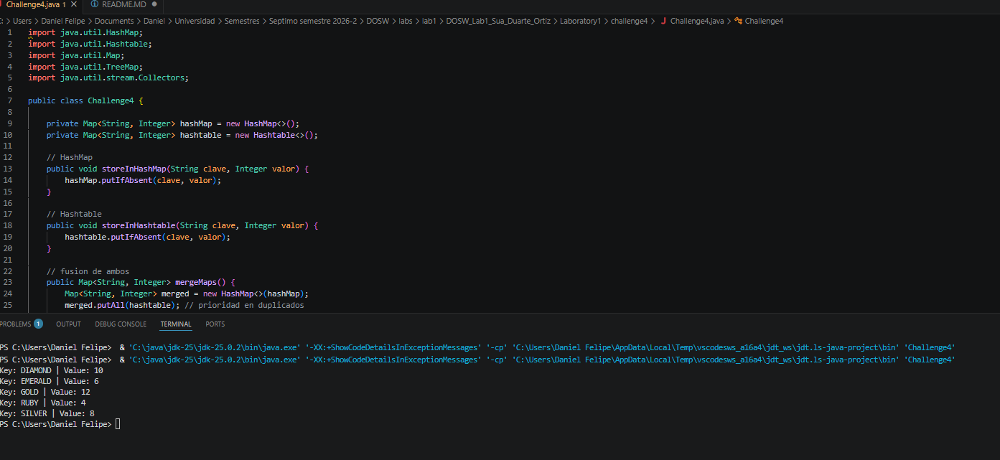
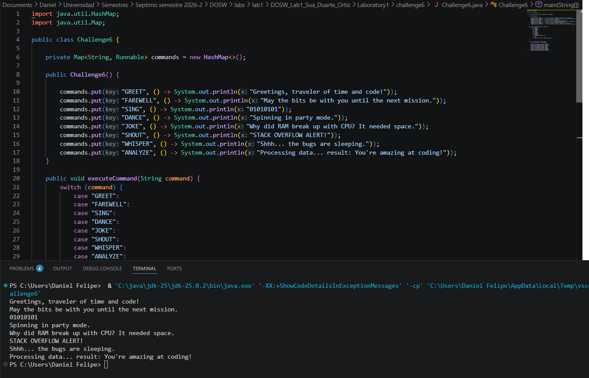

# DOSW_Lab1_Sua_Duarte_Ortiz

## Integrantes:
* Daniel Felipe Sua Siempira
  
* David Felipe Ortiz Salcedo

* Juan Pablo Duarte Silva

## Acuerdos de trabajo en equipo
Cada equipo debe definir acuerdos de trabajo en equipo, es decir, las reglas que utilizarán para trabajar juntos durante el semestre:

* ¿A qué horas te encontrarás?
Nos encontraremos ya sea presencial o asincronamente en alguna de las siguientes franjas o en varias de ellas lunes de por la mañana, martes 1:00 pm - 2:30 pm y jueves 8:30 - 10:00
* ¿Cuáles serán tus canales de comunicación: Teams, WhatsApp, Slack...?
WhatsApp para comuniación rapida, teams y discord para archivos y videollamadas
* ¿Con qué frecuencia os encontraréis?
2 sesiones una de ellas presencial otra asincrona segun disponibilidad
* Si surgiera un conflicto, ¿cómo se podría resolver?
Se resolveria, con la comunicación efectiva, exponiendo los desacuerdos de cada uno y entre el grupo se decidiria cual es la mejor solución a dicho problema

## Challenge 4 — The Treasure of Duplicate Keys

### Evidence

### Description

Para este challenge implementé dos métodos que guardan datos en un HashMap y en un 
Hashtable, ambos ignorando las claves que ya existen (usando putIfAbsent). Luego hice 
un método que junta los dos mapas: si una clave se repite en ambos, se queda con el 
valor del Hashtable, y al final las claves quedan en mayúsculas y ordenadas usando 
un TreeMap con stream y Collectors.toMap.
 
Subí los cambios con git add, commit y push a mi rama feature/challenge_4_SuaDaniel_2026-2, 
y después la fusioné a develop con git merge. No tuve conflictos porque nadie más 
estaba trabajando en los mismos archivos.

## Challenge 6 — The Decision Machine

### Evidence

### Description

Implementé una máquina de comandos usando un `Map<String, Runnable>` donde cada comando 
está asociado a una lambda que imprime su respuesta. El método executeCommand usa un 
switch para validar que el comando exista antes de ejecutarlo con .run(). Hice los 8 
comandos. Subí los cambios con git add, 
commit y push a mi rama feature/challenge_6_SuaDaniel_2026-2, y los fusioné a develop 
con git merge. No hubo conflictos.
